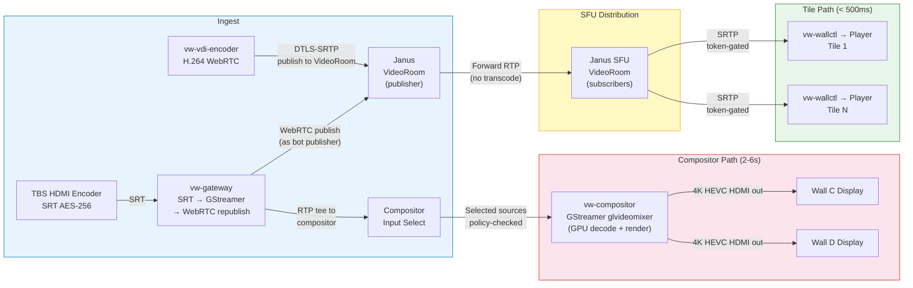
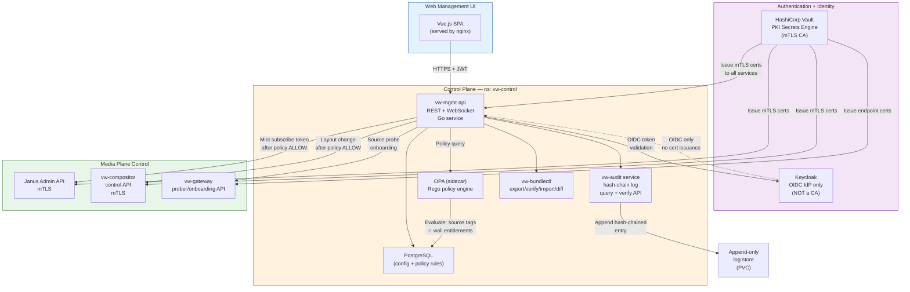
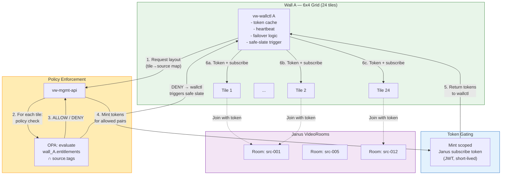
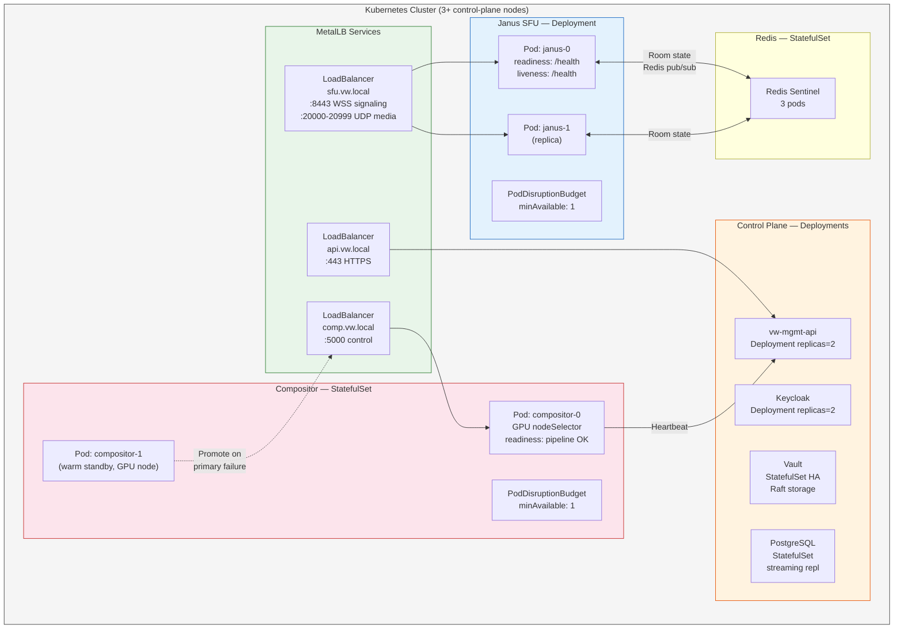
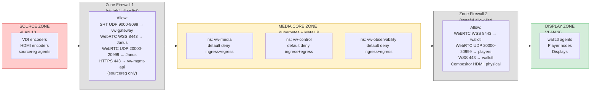

# Air-Gapped Multi-Videowall Platform — Reference Architecture v2.0

**Document Classification:** RESTRICTED  
**Version:** 2.0 — Corrected per Phase 1 review  
**Date:** 2026-02-21  
**Author:** Systems Architecture Division  
**Change Summary:** Addresses 8 mandatory fix areas: missing components (wallctl, bundlectl, vdi-encoder, sourcereg, gateway prober), tamper-evident audit, Kubernetes+MetalLB HA, Vault PKI (not Keycloak), gateway→SFU WebRTC republish, NDI removal, normalized sizing (W=4, 24-tile+2-big, N=64), and k8s NetworkPolicy default-deny.

---

## A) Executive Summary

This document specifies an implementable architecture for an **air-gapped, open-source multi-videowall platform** capable of ingesting heterogeneous video sources (VDI soft-encoders and HDMI-to-IP hardware encoders), distributing them via a combined media topology, and rendering them on configurable videowalls — each with independent layout control and source-level access enforcement.

The platform is designed for **high-security enclaves** with no Internet connectivity, strict network zoning, and offline-only update mechanisms. All components in the reference architecture are open-source or community-licensed, eliminating vendor lock-in and enabling source-code auditing.

**Key capabilities:**

- 4 independent videowalls (2× 24-tile 1080p walls, 2× dual-4K-screen walls) selecting from 28 sources with RBAC-enforced entitlements
- Sub-500 ms interactive latency via WebRTC SFU path; 2–6 s broadcast-grade latency via SRT/compositor path
- A central GStreamer compositor for large-screen mosaics alongside per-tile Janus SFU distribution
- Token-gated SFU subscriptions and policy-authorized compositor inputs at a dedicated Policy Enforcement Point (PEP)
- Tamper-evident, hash-chained audit log for all layout changes, subscriptions, and policy decisions
- mTLS identity for all endpoints and services via HashiCorp Vault PKI; operator auth via Keycloak OIDC
- Kubernetes-native deployment in the Media Core Zone with MetalLB load balancing, NetworkPolicy default-deny, and PodDisruptionBudgets
- Offline operations: `vw-bundlectl` for signed configuration bundles; offline image repos for staged rollout with rollback

The **recommended reference architecture** is **Combined C+D**: Janus SFU for many-tile distribution + GStreamer compositor for large-screen mosaics, unified under a single control plane, deployed on Kubernetes.

---

## B) Assumptions and Sizing Inputs

| Parameter | Value | Notes |
|-----------|-------|-------|
| Number of videowalls (W) | **4** | 2 multi-tile + 2 large dual-screen |
| Screens per multi-tile wall | **24** (6×4 grid of 55″ 1080p panels) | Narrow-bezel commercial |
| Screens per large wall | **2** (2× 98″ or LED, 4K) | Compositor-driven |
| Total screens | **52** | (2×24) + (2×2) |
| Source types | VDI (soft H.264), HDMI-to-IP (RTSP/SRT) | Mixed ingest |
| VDI sources | **20** | `vw-vdi-encoder` agent per VM |
| HDMI encoder sources | **8** | TBS or similar HDMI-to-IP |
| Total sources | **28** | |
| Max concurrent displayed streams (N) | **64** | Across all walls (48 tiles + 16 compositor inputs) |
| Target latency — interactive (WebRTC) | **< 500 ms** glass-to-glass | SFU path |
| Target latency — broadcast (SRT/comp) | **2–6 seconds** | Compositor/SRT path |
| Resolution — tiles | **1920×1080 @ 30 fps** | |
| Resolution — large walls | **3840×2160 @ 30 fps** | HEVC preferred |
| Bitrate per 1080p H.264 | **6 Mbps** (CBR) | Tile codec: H.264 High |
| Bitrate per 1080p HEVC | **4 Mbps** | |
| Bitrate per 4K HEVC mosaic | **15 Mbps** | Compositor output |
| Codec policy — tiles | **H.264 High** mandatory | Widest decode support |
| Codec policy — mosaics | **HEVC Main** preferred | Better quality/bitrate for 4K |
| Air-gap | Full: no Internet, no external DNS | Offline updates only |
| Orchestration | **Kubernetes (k3s or RKE2)** in Media Core Zone | MetalLB for LB |
| OS baseline | Rocky Linux 9 (hardened, CIS L2) | Servers + player nodes |

---

## C) Architecture Variants

| Criterion | Variant C: WebRTC SFU | Variant D: Central Compositor | Combined C+D (Recommended) | Optional: SRT Gateway |
|-----------|----------------------|------------------------------|---------------------------|----------------------|
| **Topology** | Janus SFU forwards per-tile | GStreamer composites mosaics | SFU for tiles; compositor for large walls | SRT relay fan-out |
| **Latency** | < 500 ms | 2–6 s | Mixed: best of both | 1–4 s |
| **Flexibility** | High: per-tile subscription | Low: pipeline-defined | High: independent tile + mosaic | Medium |
| **RBAC** | Token-gated SFU subscribe | Policy check on compositor input | Dual enforcement | Gateway relay rules |
| **GPU** | Endpoints only | Compositor node | GPU on compositor only | None |
| **Failure domain** | SFU → all tiles | Compositor → large walls | Independent domains | Per-gateway |
| **Mosaic quality** | Client-side (poor) | Server-side (excellent) | Server-side on large screens | Not native |
| **Recommendation** | Good for all-tile | Good for fixed mosaics | **Best overall** | Non-WebRTC supplement |

**Recommendation:** Combined C+D is the reference architecture.

---

## D) Recommended Reference Architecture (Combined C+D)

### D.1 High-Level Zoned Architecture

```mermaid
graph TB
    subgraph SZ["SOURCE ZONE -- VLAN 10"]
        direction TB
        VDI["vw-vdi-encoder x20<br/>GStreamer WebRTC publish<br/>mTLS + DTLS-SRTP"]
        HDMI["TBS HDMI Encoders x8<br/>SRT AES-256"]
        SREG["vw-sourcereg agents<br/>metadata + health"]
    end

    subgraph MCZ["MEDIA CORE ZONE -- Kubernetes Cluster"]
        direction TB
        subgraph NS_MEDIA["namespace: vw-media"]
            GW["vw-gateway<br/>SRT listener → WebRTC republish<br/>+ prober API"]
            SFU["Janus SFU<br/>Deployment (HA replicas)<br/>VideoRoom plugin"]
            COMP["vw-compositor<br/>GStreamer glvideomixer<br/>StatefulSet + GPU"]
        end
        subgraph NS_CTRL["namespace: vw-control"]
            API["vw-mgmt-api<br/>Go REST+WS"]
            PEP["Policy Enforcement Point<br/>OPA sidecar"]
            KC["Keycloak<br/>OIDC IdP"]
            VAULT["Vault PKI<br/>mTLS CA"]
            DB["PostgreSQL<br/>StatefulSet HA"]
            AUDIT["vw-audit<br/>hash-chain logger"]
            BUNDLE["vw-bundlectl<br/>Job/CronJob"]
        end
        subgraph NS_OBS["namespace: vw-observability"]
            PROM["Prometheus"]
            GRAF["Grafana"]
            LOKI["Loki"]
        end
        MLB["MetalLB<br/>LoadBalancer VIPs"]
    end

    subgraph DZ["DISPLAY ZONE -- VLAN 30"]
        direction TB
        subgraph WALL_AB["Walls A+B: 24-tile each"]
            WCTL_A["vw-wallctl A<br/>token cache, failover"]
            WCTL_B["vw-wallctl B<br/>token cache, failover"]
            PA["Player nodes x24<br/>GStreamer kiosk"]
            PB["Player nodes x24<br/>GStreamer kiosk"]
        end
        subgraph WALL_CD["Walls C+D: 2 big screens each"]
            WCTL_C["vw-wallctl C"]
            WCTL_D["vw-wallctl D"]
            PC["Direct HDMI from compositor"]
            PD["Direct HDMI from compositor"]
        end
    end

    VDI -->|"WebRTC publish<br/>DTLS-SRTP"| SFU
    HDMI -->|"SRT AES-256"| GW
    GW -->|"WebRTC republish"| SFU
    GW -->|"RTP feed"| COMP
    SFU -->|"SRTP per-tile"| PA & PB
    COMP -->|"HDMI 4K out"| PC & PD
    SREG -->|"Register + heartbeat"| API
    API --> PEP
    PEP --> SFU
    PEP --> COMP
    API --> AUDIT
    API --> DB
    API --> KC
    VAULT -->|"mTLS certs"| SFU & GW & COMP & API
    WCTL_A & WCTL_B -->|"WSS + JWT"| API
    WCTL_C & WCTL_D -->|"WSS + JWT"| API
    PROM -->|"scrape /metrics"| SFU & GW & COMP & API

    classDef src fill:#ffcccc,stroke:#cc0000
    classDef media fill:#fff3cd,stroke:#cc9900
    classDef disp fill:#d4edda,stroke:#28a745
    class SZ src
    class MCZ media
    class DZ disp
```



### D.2 Media Flow — Ingest → Distribution → Walls (C+D Interconnect)



**Key C+D interconnect:** The `vw-gateway` tees its output into two paths simultaneously: (1) WebRTC republish into Janus SFU for tile distribution, and (2) direct RTP feed to the compositor input selector. VDI sources publish directly to Janus; the compositor can also subscribe as a Janus VideoRoom subscriber to access VDI streams.

### D.3 Control Plane Architecture (OIDC, Vault, PEP)



### D.4 Per-Wall Token Subscription Model



**Token lifecycle:** Tokens are short-lived JWTs (5-minute TTL) scoped to `{wall_id, source_id, room_id}`. `vw-wallctl` caches tokens and refreshes them before expiry. On DENY, the tile receives a safe-slate command. On `vw-wallctl` crash, cached tokens in its local store allow players to maintain existing subscriptions for the token TTL window.

### D.5 HA Topology — Kubernetes + MetalLB



---

## E) Component-by-Component Description

### E.1 `vw-vdi-encoder` — VDI Source Agent

| Attribute | Detail |
|-----------|--------|
| **Role** | GStreamer-based agent running inside each VDI VM; captures display, encodes H.264 High Profile, publishes to Janus SFU as a WebRTC publisher |
| **Pipeline** | `ximagesrc` → `x264enc tune=zerolatency` → `rtph264pay` → `webrtcbin` |
| **Identity** | mTLS client cert issued by Vault PKI; DTLS-SRTP for media |
| **Health** | Exposes `/metrics` (Prometheus) and `/health`; reports encode FPS, bitrate, CPU |
| **Config** | Receives source ID, SFU signaling URL, and Vault cert path from `vw-sourcereg` |

### E.2 `vw-sourcereg` — Source Registration Agent

| Attribute | Detail |
|-----------|--------|
| **Role** | Lightweight agent (per-source or per-encoder-host) that registers source metadata with `vw-mgmt-api` and sends periodic health heartbeats |
| **Metadata** | Source ID, type (VDI/HDMI), codec, resolution, tags, mTLS cert fingerprint |
| **Health** | Periodic POST to `/api/v1/sources/{id}/heartbeat` with encode stats |
| **Deregistration** | On missed heartbeats (3× interval), API marks source OFFLINE; displayed tiles switch to failover or safe-slate |

### E.3 `vw-gateway` — SRT/RTSP Gateway + Prober

| Attribute | Detail |
|-----------|--------|
| **Role** | Receives SRT/RTSP from HDMI encoders; **republishes as WebRTC publisher** into Janus VideoRoom (not raw RTP injection); also provides a prober API for source onboarding |
| **Ingest pipeline** | `srtsrc` → `tsdemux` → `h264parse` → `rtph264pay` → `webrtcbin` (publish to Janus room) |
| **Compositor feed** | Tees decoded frames via `tee` → `rtph264pay` → `udpsink` to compositor RTP input (same decoded stream, second output) |
| **Prober API** | `POST /api/v1/gateway/probe` — accepts SRT/RTSP URL, runs transient GStreamer pipeline, returns codec info, resolution, bitrate, reachability status |
| **K8s** | Deployment in `vw-media` namespace; MetalLB Service for SRT UDP ingest ports (9000-9099) |
| **Identity** | Vault mTLS cert for Janus signaling; SRT AES passphrase per source |

**Fix #5 detail:** The gateway does NOT inject raw RTP into Janus. It uses `gst-plugins-bad webrtcbin` to establish a standard WebRTC publish session with Janus VideoRoom, appearing as a regular publisher. This is a fully supported, tested ingest path. Each HDMI source gets its own Janus room with the gateway as the sole publisher.

### E.4 Janus SFU — VideoRoom

| Attribute | Detail |
|-----------|--------|
| **Role** | Selective Forwarding Unit — no transcoding; forwards RTP to subscribed tiles |
| **Plugin** | `janus.plugin.videoroom` — one room per source |
| **Signaling** | WebSocket (WSS on TCP/8443) with **token auth**: subscribe requests must include a valid JWT minted by `vw-mgmt-api` after policy ALLOW |
| **Token validation** | Janus `token_auth` plugin configured with shared HMAC secret (rotated via Vault); token contains `{room_id, feed_id, exp, wall_id}` |
| **Media** | DTLS-SRTP (UDP/20000-20999) |
| **Admin API** | HTTP on TCP/7088, mTLS-protected; used by `vw-mgmt-api` to manage rooms |
| **K8s** | Deployment (replicas=2) in `vw-media`; Redis Sentinel for room state sync; MetalLB for signaling VIP and UDP media range |

### E.5 `vw-compositor` — GStreamer Mosaic Compositor

| Attribute | Detail |
|-----------|--------|
| **Role** | Server-side mosaic rendering for large (4K) displays |
| **Input** | RTP streams from gateway tee (pre-policy-checked by `vw-mgmt-api`); can also subscribe to Janus rooms as a WebRTC subscriber for VDI sources |
| **Pipeline** | `glvideomixer` with dynamic pad management; GPU decode via VAAPI/NVDEC |
| **Output** | HDMI/DP via GPU (direct attach); **no NDI** (OSS-only: use direct HDMI or SRT output to display node if networked) |
| **Control API** | REST on TCP/5000 (mTLS); accepts layout commands: pad positions, z-order, source assignment |
| **Policy** | Every input source addition triggers a policy check via `vw-mgmt-api` → OPA before the compositor pad is linked |
| **K8s** | StatefulSet in `vw-media`; `nodeSelector` for GPU nodes; PDB minAvailable=1 |
| **GPU** | NVIDIA T400/A2000 (NVDEC decode + OpenGL render) or Intel Arc A380 (VAAPI) |

**Fix #6:** NDI is removed from the reference architecture. Compositor output is direct HDMI/DP from GPU to displays (zero network hop for large walls). If networked display nodes are required, use SRT or raw RTP over the Display VLAN — never proprietary protocols.

### E.6 `vw-mgmt-api` — Management API

| Attribute | Detail |
|-----------|--------|
| **Language** | Go |
| **Database** | PostgreSQL 15 (walls, sources, layouts, policy rules, tokens) |
| **Auth** | OIDC via Keycloak (local); JWT bearer tokens |
| **Key endpoints** | |
| | `POST /api/v1/tokens/subscribe` — mint scoped Janus token after policy check |
| | `POST /api/v1/policy/evaluate` — dry-run policy query |
| | `GET/POST /api/v1/sources` — source CRUD + tag management |
| | `GET/POST /api/v1/walls` — wall CRUD + entitlements |
| | `GET/POST /api/v1/layouts/{wall_id}` — layout CRUD + presets |
| | `POST /api/v1/bundles/export`, `POST /api/v1/bundles/import`, `POST /api/v1/bundles/verify`, `POST /api/v1/bundles/diff` — bundle ops |
| | `GET /api/v1/audit` — query audit log; `POST /api/v1/audit/verify` — verify chain |
| | `POST /api/v1/gateway/probe` — proxy to gateway prober |
| **WebSocket** | Push layout updates, health events, token refresh to `vw-wallctl` agents |
| **K8s** | Deployment (replicas=2) in `vw-control`; MetalLB Service on :443 |

### E.7 `vw-wallctl` — Wall Controller Agent

| Attribute | Detail |
|-----------|--------|
| **Role** | Per-wall agent running in Display Zone; orchestrates tile players, manages token lifecycle, handles failover |
| **Functions** | |
| | **Token orchestration:** requests subscribe tokens from `vw-mgmt-api` for each tile→source mapping; caches tokens locally; refreshes before TTL expiry |
| | **Player management:** starts/stops/reconfigures GStreamer kiosk processes on each player node (via SSH or local agent) |
| | **Failover:** on source loss (no RTP for >5 s), switches tile to fallback source or safe-slate; on SFU loss, shows safe-slate on all tiles |
| | **Safe slate:** renders a colored background + overlay text ("SOURCE UNAVAILABLE — WALL A / TILE 7") via local GStreamer test pipeline |
| | **Heartbeat:** sends wall status to `vw-mgmt-api` every 5 s; includes per-tile health (FPS, dropped frames, latency) |
| | **Layout application:** receives layout commands from API via WebSocket; translates to tile subscribe/unsubscribe operations |
| **Identity** | Vault mTLS cert; authenticates to API with service account JWT |
| **Platform** | Runs on a dedicated mini-PC or the first player node per wall |

### E.8 `vw-audit` — Tamper-Evident Audit Logger

| Attribute | Detail |
|-----------|--------|
| **Role** | Append-only, hash-chained audit log service |
| **Storage** | PostgreSQL table `audit_entries` on PVC; append-only (no UPDATE/DELETE grants) |
| **Schema** | `{seq, timestamp, actor, action, target, old_value, new_value, hash, prev_hash}` |
| **Hash chain** | Each entry: `hash = SHA-256(seq ‖ timestamp ‖ actor ‖ action ‖ target ‖ payload ‖ prev_hash)` |
| **Verification** | `GET /api/v1/audit/verify?from=SEQ&to=SEQ` — walks the chain forward, validates every hash; returns `{valid: true/false, broken_at: SEQ}` |
| **Retention** | Configurable (default 365 days); archival export as signed JSON bundle |
| **Export** | `GET /api/v1/audit/export?from=DATE&to=DATE` — returns signed JSONL with embedded hashes |
| **Events logged** | Layout changes, source subscriptions, policy decisions (allow/deny), token mints, operator logins, source register/deregister, config imports, failover events |
| **K8s** | Deployment in `vw-control`; writes to PostgreSQL (separate schema, restricted user with INSERT-only + SELECT) |

**Fix #2:** rsyslog→SQLite is removed. The audit system is a purpose-built service with cryptographic hash chaining, a verification API, and append-only database enforcement.

### E.9 `vw-bundlectl` — Offline Configuration Bundle Tool

| Attribute | Detail |
|-----------|--------|
| **Role** | CLI tool for exporting, verifying, importing, and diffing signed configuration bundles between air-gapped enclaves |
| **Format** | `bundle.tar.zst` — zstd-compressed tar archive containing: `config.json` (walls, sources, layouts, policies, certs), `manifest.json` (file list + SHA-256 per file), `signature.ed25519` (Ed25519 signature over manifest) |
| **Commands** | |
| | `vw-bundlectl export --output bundle.tar.zst --sign-key /path/to/key` |
| | `vw-bundlectl verify --bundle bundle.tar.zst --pub-key /path/to/pubkey` |
| | `vw-bundlectl import --bundle bundle.tar.zst --pub-key /path/to/pubkey [--dry-run]` |
| | `vw-bundlectl diff --bundle bundle.tar.zst --against current` |
| **Security** | Bundles are cryptographically signed; import rejects invalid signatures; diff shows changes before apply |
| **K8s integration** | Can run as a Job or via `vw-mgmt-api` endpoints (`/api/v1/bundles/*`) |

### E.10 Authentication & PKI

| Component | Role |
|-----------|------|
| **Keycloak** (local) | OIDC Identity Provider **only** — user directory, roles (admin/operator/viewer), TOTP MFA. **Keycloak does NOT issue mTLS certificates.** |
| **HashiCorp Vault** (PKI Secrets Engine) | **Sole mTLS Certificate Authority** for all services, endpoints, encoders, and player agents. Runs as StatefulSet with Raft HA backend. |
| **Trust anchors** | Vault root CA cert distributed to all nodes via `vw-bundlectl` or Ansible; intermediate CA issues short-lived certs (24h TTL, auto-renewed by Vault Agent sidecar) |
| **Cert rotation** | Vault Agent injector sidecar in each pod; endpoints use `vault agent` binary on bare-metal nodes; certs auto-renewed at 70% of TTL |
| **Revocation** | Vault CRL endpoint (pulled by all services every 15 min via local HTTP); OCSP not used (air-gapped simplicity) |

**Fix #4:** Keycloak is an OIDC IdP only. Vault PKI is the sole CA. `step-ca` is removed.

### E.11 Observability Stack

| Component | K8s Resource | Namespace | Port |
|-----------|-------------|-----------|------|
| **Prometheus** | StatefulSet | vw-observability | 9090 |
| **Grafana** | Deployment | vw-observability | 3000 |
| **Loki** | StatefulSet | vw-observability | 3100 |
| **Node exporter** | DaemonSet | vw-observability | 9100 |
| **Alertmanager** | Deployment | vw-observability | 9093 |

All components expose `/metrics`. Grafana dashboards: wall health, per-tile latency, SFU load, compositor pipeline, bitrate heatmaps, audit event rate.

---

## F) Security Controls Mapped to Zones

### F.1 Network Zoning with Kubernetes NetworkPolicy



### F.2 Kubernetes NetworkPolicy — Default Deny + Allow-List

All three namespaces have a default-deny policy:

```yaml
# Applied to each namespace
apiVersion: networking.k8s.io/v1
kind: NetworkPolicy
metadata:
  name: default-deny-all
spec:
  podSelector: {}
  policyTypes: [Ingress, Egress]
```

**Inter-Service Flow Allow-List:**

| From (ns/pod) | To (ns/pod) | Port | Proto | Direction | Purpose |
|---------------|-------------|------|-------|-----------|---------|
| VLAN 10 (ext) | vw-media/janus | 8443 | TCP | Ingress | WebRTC signaling |
| VLAN 10 (ext) | vw-media/janus | 20000-20999 | UDP | Ingress | WebRTC media |
| VLAN 10 (ext) | vw-media/vw-gateway | 9000-9099 | UDP | Ingress | SRT ingest |
| VLAN 10 (ext) | vw-control/vw-mgmt-api | 443 | TCP | Ingress | sourcereg heartbeat |
| VLAN 30 (ext) | vw-media/janus | 8443 | TCP | Ingress | wallctl signaling |
| VLAN 30 (ext) | vw-media/janus | 20000-20999 | UDP | Ingress | Player media |
| VLAN 30 (ext) | vw-control/vw-mgmt-api | 443 | TCP | Ingress | wallctl API+WS |
| vw-media/vw-gateway | vw-media/janus | 8443,20000+ | TCP+UDP | Egress | WebRTC republish |
| vw-media/vw-gateway | vw-media/vw-compositor | 5004-5099 | UDP | Egress | RTP tee to compositor |
| vw-control/vw-mgmt-api | vw-media/janus | 7088 | TCP | Egress | Janus admin API |
| vw-control/vw-mgmt-api | vw-media/vw-compositor | 5000 | TCP | Egress | Compositor control |
| vw-control/vw-mgmt-api | vw-media/vw-gateway | 7080 | TCP | Egress | Gateway prober API |
| vw-control/vw-mgmt-api | vw-control/keycloak | 8080 | TCP | Egress | OIDC validation |
| vw-control/vw-mgmt-api | vw-control/vault | 8200 | TCP | Egress | Cert operations |
| vw-control/vw-mgmt-api | vw-control/postgresql | 5432 | TCP | Egress | Database |
| vw-control/vw-mgmt-api | vw-control/vw-audit | 8090 | TCP | Egress | Audit writes |
| vw-control/vw-audit | vw-control/postgresql | 5432 | TCP | Egress | Audit DB |
| vw-observability/prometheus | vw-media/* | 9100 | TCP | Egress | Metrics scrape |
| vw-observability/prometheus | vw-control/* | 9100 | TCP | Egress | Metrics scrape |
| ALL pods | vw-control/vault | 8200 | TCP | Egress | Cert renewal |

### F.3 RBAC and Policy Model

**Entities:**
- **Sources** have tags: `classification:SECRET`, `domain:intel`, `domain:ops`
- **Walls** have entitlements: `clearance:SECRET`, `domain:ops`
- **Operators** have roles: `admin`, `operator:{wall-id}`, `viewer`

**Policy rule (OPA Rego):**

```rego
package vw.policy

default allow_subscribe = false

allow_subscribe {
    input.source.classification == input.wall.clearance
    count(input.source.domains & input.wall.domains) > 0
    input.operator.role in {"admin", concat(":", ["operator", input.wall.id])}
}
```

**Enforcement points:**
1. **SFU subscribe:** `vw-mgmt-api` evaluates policy before minting Janus token
2. **Compositor input:** `vw-mgmt-api` evaluates policy before sending pad-link command
3. **UI filtering:** Source list filtered per operator's visible entitlements

---

## G) Web UI Functional Specification

### G.1 Technology

Vue.js 3 + TypeScript + Vuetify 3 (offline-capable). Served as static assets by nginx. Auth via Keycloak JS adapter (OIDC).

### G.2 Pages

| Page | Roles | Description |
|------|-------|-------------|
| **Login** | All | Keycloak OIDC; role auto-detected from JWT |
| **Dashboard** | All | Wall status tiles, system health, recent audit events |
| **Wall Inventory** | All | List walls + health; click-through to per-tile detail |
| **Layout Editor** | Admin, Operator | Drag-and-drop grid editor; assign sources to tiles; span tiles; presets/scenes; bezel compensation; preview+apply (triggers PEP check + token mint) |
| **Source Onboarding** | Admin | Wizard: select type → enter connection → probe via gateway → assign tags → assign cert → register |
| **Access Control** | Admin | Source tag manager; wall entitlement editor; operator permission matrix; policy test tool |
| **Failover Rules** | Admin, Operator | Per-tile failover chain; timeout config; safe-slate definition |
| **Audit Log** | All (read-only) | Searchable, filterable log; chain verification trigger; CSV export |
| **Bundle Manager** | Admin | Export/import/verify/diff signed bundles; shows last import status |
| **System Settings** | Admin | Vault PKI status; Keycloak user management link; update staging dashboard |

---

## H) Sizing Tables

### H.1 Bitrate Assumptions

| Stream | Codec | Resolution | FPS | Bitrate |
|--------|-------|-----------|-----|---------|
| VDI tile | H.264 High | 1080p | 30 | 6 Mbps |
| HDMI encoder tile | H.264 Main | 1080p | 30 | 8 Mbps |
| Compositor mosaic out | HEVC Main | 4K | 30 | 15 Mbps |

### H.2 Small Tier (2 walls: 1×24-tile + 1×2-big, 16 sources, 26 concurrent)

| Component | CPU | RAM | Storage | Net In | Net Out | GPU | K8s Resource |
|-----------|-----|-----|---------|--------|---------|-----|-------------|
| vw-gateway | 4c | 8 GB | 50 GB | 64 Mbps | 64 Mbps | — | Deployment ×1 |
| Janus SFU (×2) | 8c ea | 16 GB ea | 50 GB | 128 Mbps | 200 Mbps | — | Deployment ×2 |
| vw-compositor | 8c | 16 GB | 100 GB | 80 Mbps | 30 Mbps | T400 4GB | StatefulSet ×1 |
| vw-mgmt-api (×2) | 2c ea | 4 GB ea | — | neg. | neg. | — | Deployment ×2 |
| Keycloak | 2c | 4 GB | — | neg. | neg. | — | Deployment ×1 |
| Vault | 2c | 4 GB | 20 GB | neg. | neg. | — | StatefulSet ×1 |
| PostgreSQL | 4c | 8 GB | 200 GB | neg. | neg. | — | StatefulSet ×1 |
| Redis Sentinel (×3) | 1c ea | 2 GB ea | 10 GB | neg. | neg. | — | StatefulSet ×3 |
| Prometheus+Grafana+Loki | 4c | 8 GB | 500 GB | neg. | neg. | — | StatefulSet+Dep |
| Player node (×24) | 2c ea | 4 GB ea | 32 GB | 8 Mbps ea | neg. | iGPU | Bare-metal |
| vw-wallctl (×2) | 2c ea | 2 GB ea | 16 GB | neg. | neg. | — | Bare-metal |

**Total cluster:** ~50 cores, ~100 GB RAM, 1 GPU, ~1.5 Gbps switching

### H.3 Medium/Large Tier (4 walls: 2×24-tile + 2×2-big, 28 sources, 64 concurrent)

| Component | CPU | RAM | Storage | Net In | Net Out | GPU | K8s Resource |
|-----------|-----|-----|---------|--------|---------|-----|-------------|
| vw-gateway (×2) | 4c ea | 8 GB ea | 50 GB | 96 Mbps ea | 96 Mbps ea | — | Deployment ×2 |
| Janus SFU (×2) | 16c ea | 32 GB ea | 100 GB | 384 Mbps | 600 Mbps | — | Deployment ×2 |
| vw-compositor (×2) | 16c ea | 32 GB ea | 200 GB | 160 Mbps | 60 Mbps | A2000 6GB ea | StatefulSet ×2 |
| vw-mgmt-api (×2) | 4c ea | 8 GB ea | — | neg. | neg. | — | Deployment ×2 |
| Keycloak (×2) | 2c ea | 4 GB ea | — | neg. | neg. | — | Deployment ×2 |
| Vault (×3 Raft) | 2c ea | 4 GB ea | 20 GB ea | neg. | neg. | — | StatefulSet ×3 |
| PostgreSQL (×2) | 4c ea | 16 GB ea | 500 GB | neg. | neg. | — | StatefulSet ×2 |
| Redis Sentinel (×3) | 2c ea | 4 GB ea | 20 GB | neg. | neg. | — | StatefulSet ×3 |
| Prom+Graf+Loki+Alert | 8c | 16 GB | 1 TB | neg. | neg. | — | Mixed |
| Player node (×48) | 4c ea | 8 GB ea | 32 GB | 8 Mbps ea | neg. | iGPU | Bare-metal |
| vw-wallctl (×4) | 2c ea | 4 GB ea | 16 GB | neg. | neg. | — | Bare-metal |

**Total cluster:** ~120 cores, ~300 GB RAM, 2 GPUs, ~3 Gbps switching

### H.4 Cost Drivers

| Driver | Impact | Mitigation |
|--------|--------|------------|
| SFU fan-out (N=64 tiles) | Network-dominant: 64×6 Mbps = 384 Mbps egress | 10 GbE NICs; no transcode |
| Compositor decodes | GPU-bound: 16 simultaneous 1080p decodes per compositor | Limit active inputs to displayed sources |
| Player node count | Linear hardware cost (48 nodes for tile walls) | Dual-head players: 2 tiles per node → 24 nodes |
| Monitoring retention | Storage growth | 90-day hot, archive to bundle export |

---

## I) Raspberry Pi Feasibility (unchanged from v1.0)

Use **Raspberry Pi 5 + active cooling + NVMe** for 1080p30 H.264 tiles only. Not viable for 4K. See v1.0 Section I for full test plan.

---

## J) TBS HDMI Encoder Integration (unchanged from v1.0)

TBS encoders integrated via SRT AES-256 to `vw-gateway` on Source VLAN. See v1.0 Section J for secure integration checklist.

---

## K) Deployment & Hardening Checklist

### K.1 Kubernetes-Specific

- [ ] Deploy k3s or RKE2 with hardened profile (`--protect-kernel-defaults`, `--secrets-encryption`)
- [ ] Install MetalLB in L2 mode; assign VIP pool for `vw-media` and `vw-control` services
- [ ] Apply default-deny NetworkPolicy to all three namespaces before deploying workloads
- [ ] Configure PodSecurityStandards (restricted baseline): non-root, read-only rootfs, drop all capabilities
- [ ] Deploy Vault with Raft HA; initialize with Shamir unseal (5/3 threshold); store unseal keys on HSM or secure offline media
- [ ] Import container images into local Harbor/Zot registry from air-gap transfer media
- [ ] Scan all images with Trivy (offline DB) before admission

### K.2 Staged Rollout

1. **Prepare** (Internet-connected build workstation): pull images, build bundles, sign with offline key, transfer via write-once media
2. **Import** into local registry; verify image signatures (cosign)
3. **Stage** to observability namespace first (lowest risk)
4. **Roll** control plane: Vault → Keycloak → PostgreSQL → vw-mgmt-api → vw-audit
5. **Roll** media plane: vw-gateway → Janus (canary replica first) → vw-compositor (standby first)
6. **Roll** display zone: vw-wallctl agents → player node OS updates (2 at a time)
7. **Verify** end-to-end: run `vw-bundlectl verify` + audit chain verification + manual display check
8. **Rollback** plan: Helm rollback per release; PostgreSQL migration revert script

---

## L) Normative Requirements Checklist

| ID | Requirement | MUST/SHOULD | Section |
|----|------------|-------------|---------|
| REQ-ZONE-001 | Source Zone, Media Core Zone, and Display Zone MUST be on separate VLANs with stateful firewalls between them | MUST | F.1 |
| REQ-ZONE-002 | Kubernetes namespaces (vw-media, vw-control, vw-observability) MUST have default-deny NetworkPolicy | MUST | F.2 |
| REQ-ZONE-003 | All inter-service flows MUST be explicitly allowed via NetworkPolicy with port+protocol specificity | MUST | F.2 |
| REQ-AUTH-001 | Operator authentication MUST use Keycloak OIDC with JWT bearer tokens | MUST | E.10 |
| REQ-AUTH-002 | Keycloak MUST NOT issue mTLS certificates; Vault PKI is the sole CA | MUST | E.10 |
| REQ-AUTH-003 | All service-to-service communication MUST use mTLS with Vault-issued short-lived certificates | MUST | E.10 |
| REQ-AUTH-004 | Vault MUST run as HA StatefulSet with Raft backend; unseal keys MUST be stored offline | MUST | E.10, D.5 |
| REQ-PEP-001 | SFU subscribe/join MUST be token-gated: tokens minted by vw-mgmt-api only after OPA policy ALLOW | MUST | E.4, D.4 |
| REQ-PEP-002 | Compositor input source additions MUST be authorized through vw-mgmt-api → OPA policy check | MUST | E.5 |
| REQ-PEP-003 | Policy model MUST support source tags and wall entitlements with set-intersection semantics | MUST | F.3 |
| REQ-AUDIT-001 | Audit log MUST be append-only with SHA-256 hash chaining (each entry references prev_hash) | MUST | E.8 |
| REQ-AUDIT-002 | Audit service MUST provide a verification API that walks the hash chain and reports integrity | MUST | E.8 |
| REQ-AUDIT-003 | All layout changes, subscriptions, policy decisions, logins, and failovers MUST be logged | MUST | E.8 |
| REQ-AUDIT-004 | Audit log SHOULD support signed JSONL export for archival | SHOULD | E.8 |
| REQ-COMP-001 | vw-wallctl MUST run per-wall with token caching, failover logic, and safe-slate capability | MUST | E.7 |
| REQ-COMP-002 | vw-bundlectl MUST implement export, verify, import, diff commands with Ed25519-signed bundles | MUST | E.9 |
| REQ-COMP-003 | vw-vdi-encoder MUST publish to Janus via standard WebRTC (not raw RTP injection) | MUST | E.1 |
| REQ-COMP-004 | vw-sourcereg MUST register source metadata and send periodic heartbeats to vw-mgmt-api | MUST | E.2 |
| REQ-COMP-005 | vw-gateway MUST republish HDMI encoder streams as WebRTC publishers into Janus VideoRoom | MUST | E.3 |
| REQ-COMP-006 | vw-gateway MUST provide a prober/onboarding API for source validation | MUST | E.3 |
| REQ-GW-001 | Gateway MUST NOT inject raw RTP into Janus; it MUST use webrtcbin WebRTC publish | MUST | E.3 |
| REQ-HA-001 | Janus SFU MUST run as Kubernetes Deployment with ≥2 replicas and PodDisruptionBudget | MUST | D.5 |
| REQ-HA-002 | Compositor MUST run as StatefulSet with GPU nodeSelector and warm standby | MUST | D.5 |
| REQ-HA-003 | MetalLB MUST provide LoadBalancer VIPs for SFU, API, and compositor services | MUST | D.5 |
| REQ-HA-004 | Keepalived MUST NOT be used; all HA is Kubernetes-native | MUST | D.5 |
| REQ-OSS-001 | Reference architecture MUST use only open-source components; NDI is prohibited | MUST | E.5 |
| REQ-OSS-002 | Compositor output MUST use direct HDMI/DP or SRT — no proprietary protocols | MUST | E.5 |
| REQ-OFFLINE-001 | All container images MUST be available from local registry; no external pulls | MUST | K.1 |
| REQ-OFFLINE-002 | Configuration bundles MUST be signed (Ed25519) and verifiable offline | MUST | E.9 |
| REQ-OFFLINE-003 | Staged rollout MUST follow the sequence: observability → control → media → display | SHOULD | K.2 |
| REQ-SIZE-001 | Architecture MUST support W=4, S=24+2, N=64 concurrent streams | MUST | B |
| REQ-SIZE-002 | Codec policy: tiles MUST use H.264; mosaics SHOULD use HEVC | MUST/SHOULD | B |
| REQ-UI-001 | Web UI MUST implement layout editor with drag-and-drop, presets, and PEP-integrated apply | MUST | G.2 |
| REQ-UI-002 | Web UI MUST implement source onboarding wizard with gateway probe integration | MUST | G.2 |
| REQ-UI-003 | Web UI MUST implement audit log viewer with chain verification trigger | MUST | G.2 |
| REQ-UI-004 | Web UI MUST implement bundle import/export/verify/diff interface | MUST | G.2 |

---

## Appendix: Open-Source Components

| Component | Choice | Justification |
|-----------|--------|---------------|
| Media framework | GStreamer 1.24+ | Native SRT, RTP, WebRTC (`webrtcbin`), compositor, VAAPI/NVDEC; auditable |
| SRT library | libsrt (Haivision OSS) | AES encryption, low-latency; Apache-2.0 |
| WebRTC SFU | Janus Gateway | C-based, low overhead, VideoRoom + token_auth; GPL-3 |
| Player | GStreamer kiosk | Tight pipeline control, VAAPI HW decode |
| IdP | Keycloak 24+ | OIDC, RBAC, MFA, offline-capable; Apache-2.0 |
| PKI CA | HashiCorp Vault (PKI engine) | mTLS lifecycle, CRL, Raft HA; BSL/MPL-2.0 |
| Policy engine | Open Policy Agent (OPA) | Rego policies, sidecar-embeddable; Apache-2.0 |
| Database | PostgreSQL 16 | FIPS-capable, streaming replication; PostgreSQL License |
| Monitoring | Prometheus + Grafana + Loki | Pull-based, offline-compatible; Apache-2.0 |
| Config mgmt | Ansible | Agentless, idempotent, offline repos |
| K8s distribution | k3s or RKE2 | Lightweight, air-gap install support; Apache-2.0 |
| Load balancer | MetalLB | Bare-metal LB, L2/BGP modes; Apache-2.0 |
| Container registry | Harbor or Zot | OCI-compliant, offline mirror; Apache-2.0 |
| Image signing | cosign (Sigstore) | Keyless or keyed; verify at admission; Apache-2.0 |
| Bundle compression | zstd | Fast, high ratio; BSD |

---

# PHASE 2 — Repository Compliance Review

## Repository Access Status

**The `airgap-videowall` GitHub repository was not accessible** (clone failed — repo does not exist as a public repository, or is private/internal). All compliance assessments below are marked **UNKNOWN** with explicit inspection instructions for when repo access is available.

**Assumption recorded:** The repo is a private/internal repository. The compliance matrix below provides the exact file paths and code patterns to check once access is granted.

---

## Compliance Matrix

| Req ID | Requirement | Repo Evidence to Check | Status | Fix Required | Effort | Risk |
|--------|------------|----------------------|--------|-------------|--------|------|
| REQ-ZONE-001 | Separate VLANs with stateful firewalls | `docs/network-topology.*`, infrastructure playbooks | UNKNOWN | Verify VLAN config exists | S | High |
| REQ-ZONE-002 | Default-deny NetworkPolicy per namespace | `charts/*/templates/networkpolicy.yaml` — check for `podSelector: {}` + both Ingress+Egress policyTypes | UNKNOWN | Create if missing | M | High |
| REQ-ZONE-003 | Explicit allow-list NetworkPolicies | `charts/*/templates/networkpolicy-allow-*.yaml` — check ports match F.2 table | UNKNOWN | Create per flow | M | High |
| REQ-AUTH-001 | Keycloak OIDC auth | `charts/keycloak/`, `services/mgmt-api/` — check OIDC middleware, realm config JSON | UNKNOWN | Verify realm bootstrap | S | Med |
| REQ-AUTH-002 | Keycloak NOT a CA; Vault PKI is sole CA | Search repo for `step-ca`, `keycloak.*cert`, `keycloak.*pki` — must be absent; check `charts/vault/` exists | UNKNOWN | Remove step-ca refs; add Vault chart | M | High |
| REQ-AUTH-003 | mTLS via Vault on all services | `charts/*/templates/deployment.yaml` — check for Vault Agent init/sidecar containers; check TLS volume mounts | UNKNOWN | Add Vault Agent sidecar to all charts | L | High |
| REQ-AUTH-004 | Vault HA StatefulSet with Raft | `charts/vault/templates/statefulset.yaml` — check `ha.enabled: true`, Raft config | UNKNOWN | Add or fix Vault chart | M | High |
| REQ-PEP-001 | Token-gated SFU subscribe | `services/mgmt-api/handlers/tokens.go` or `*/subscribe*` — check `/tokens/subscribe` endpoint exists; verify OPA call before token mint | UNKNOWN | Implement token endpoint + OPA integration | L | High |
| REQ-PEP-002 | Compositor policy check | `services/compositor/` or `services/mgmt-api/handlers/compositor.go` — check policy eval before pad-link | UNKNOWN | Add policy gate to compositor control | M | High |
| REQ-PEP-003 | Tag-based policy with set-intersection | `policies/*.rego` or `services/mgmt-api/policy/` — check Rego rule matching F.3 semantics | UNKNOWN | Create Rego policy files | S | Med |
| REQ-AUDIT-001 | Hash-chained append-only audit | `services/audit/` or `services/mgmt-api/audit/` — check for `prev_hash` field, SHA-256 computation, INSERT-only DB user | UNKNOWN | Implement hash-chain audit service | L | High |
| REQ-AUDIT-002 | Verification API | `services/audit/handlers/verify.go` or API route `/audit/verify` | UNKNOWN | Implement verify endpoint | M | High |
| REQ-AUDIT-003 | All events logged | Search for audit emit calls in: layout handlers, subscribe handlers, policy handlers, auth handlers | UNKNOWN | Add audit hooks to all mutation points | M | Med |
| REQ-AUDIT-004 | Signed JSONL export | `services/audit/handlers/export.go` or CLI | UNKNOWN | Implement export with signing | S | Low |
| REQ-COMP-001 | vw-wallctl with token cache + failover | `services/wallctl/` or `agents/wallctl/` — check for token cache struct, failover state machine, safe-slate trigger | UNKNOWN | Implement wallctl agent | L | High |
| REQ-COMP-002 | vw-bundlectl CLI | `cmd/bundlectl/` or `tools/bundlectl/` — check `export`, `verify`, `import`, `diff` subcommands; Ed25519 signing | UNKNOWN | Implement bundlectl | L | Med |
| REQ-COMP-003 | vw-vdi-encoder WebRTC publish | `agents/vdi-encoder/` — check GStreamer webrtcbin pipeline, mTLS config | UNKNOWN | Implement vdi-encoder agent | M | Med |
| REQ-COMP-004 | vw-sourcereg heartbeat | `agents/sourcereg/` — check register+heartbeat loop, `/sources/{id}/heartbeat` API call | UNKNOWN | Implement sourcereg agent | S | Med |
| REQ-COMP-005 | Gateway WebRTC republish | `services/gateway/` — check GStreamer pipeline uses `webrtcbin` to publish (NOT raw udpsink to Janus) | UNKNOWN | Fix pipeline if raw RTP; implement WebRTC publish | M | High |
| REQ-COMP-006 | Gateway prober API | `services/gateway/handlers/probe.go` or `/gateway/probe` route | UNKNOWN | Implement probe endpoint | S | Med |
| REQ-GW-001 | No raw RTP to Janus | `services/gateway/pipeline.*` — grep for `udpsink.*janus` or `rtpsink` — must be absent | UNKNOWN | Replace with webrtcbin publish | M | High |
| REQ-HA-001 | Janus Deployment ≥2 replicas + PDB | `charts/janus/templates/deployment.yaml` — check `replicas`, `charts/janus/templates/pdb.yaml` | UNKNOWN | Add PDB; ensure replicas≥2 | S | Med |
| REQ-HA-002 | Compositor StatefulSet + GPU nodeSelector | `charts/compositor/templates/statefulset.yaml` — check `nodeSelector`, GPU resource requests | UNKNOWN | Convert to StatefulSet if Deployment; add GPU selector | M | Med |
| REQ-HA-003 | MetalLB Services | `charts/*/templates/service.yaml` — check `type: LoadBalancer` + MetalLB annotations | UNKNOWN | Add LoadBalancer services | S | Med |
| REQ-HA-004 | No Keepalived | Search entire repo for `keepalived` — must be absent | UNKNOWN | Remove any references | S | Low |
| REQ-OSS-001 | No NDI | Search entire repo for `ndi`, `NDI`, `libndi` — must be absent from reference arch | UNKNOWN | Remove/replace with SRT or HDMI | S | Low |
| REQ-OFFLINE-001 | Local registry, no external pulls | `charts/*/values.yaml` — check `image.registry` is overridable; `scripts/mirror-images.sh` exists | UNKNOWN | Add registry override + mirror script | M | Med |
| REQ-OFFLINE-002 | Signed bundles | See REQ-COMP-002 | UNKNOWN | See REQ-COMP-002 | L | Med |
| REQ-SIZE-001 | W=4, N=64 | `charts/*/values.yaml` or `docs/sizing.*` — check defaults match | UNKNOWN | Update values/docs | S | Low |
| REQ-UI-001 | Layout editor with PEP | `web/src/views/LayoutEditor.*` or similar — check drag-drop + API call to `/layouts` with token flow | UNKNOWN | Implement/complete layout editor | L | Med |
| REQ-UI-002 | Source onboarding wizard | `web/src/views/SourceOnboarding.*` — check probe call to gateway | UNKNOWN | Implement wizard | M | Med |
| REQ-UI-003 | Audit viewer + chain verify | `web/src/views/AuditLog.*` — check verify button calling `/audit/verify` | UNKNOWN | Implement audit viewer | M | Med |
| REQ-UI-004 | Bundle UI | `web/src/views/BundleManager.*` | UNKNOWN | Implement bundle UI | M | Low |

---

## Remediation PR Plan (≤ 8 PRs)

Once repo access is available, execute these PRs in order:

### PR 1: Security Foundation — Vault PKI + NetworkPolicy Default-Deny
**Scope:** Charts, infrastructure  
**Files:**
- `charts/vault/` — full Helm chart (StatefulSet, HA Raft, PKI engine bootstrap Job)
- `charts/*/templates/networkpolicy-default-deny.yaml` — one per namespace
- `charts/*/templates/networkpolicy-allow.yaml` — explicit allows per F.2 table
- Remove any `step-ca` charts/references; remove Keepalived references  
**Acceptance tests:** `kubectl get networkpolicy -A` shows default-deny in all 3 namespaces; Vault unseals and issues test cert; cross-namespace traffic blocked by default  
**Security:** Vault unseal keys must be split (Shamir 5/3); PKI root CA must be offline-generated

### PR 2: Audit Service — Hash-Chained Append-Only Log
**Scope:** New service  
**Files:**
- `services/vw-audit/` — Go service: hash-chain append, verify, export, query endpoints
- `services/vw-audit/migrations/001_audit_entries.sql` — table schema with INSERT-only user
- `charts/vw-audit/` — Helm chart with PVC, NetworkPolicy, Vault sidecar
- `services/mgmt-api/audit/client.go` — audit client library for API to emit events  
**Acceptance tests:** Insert 1000 entries; verify chain passes; tamper one entry; verify chain detects break  
**Security:** DB user has INSERT + SELECT only; no UPDATE/DELETE

### PR 3: Token-Gated SFU + Compositor Policy Enforcement
**Scope:** mgmt-api, Janus config, compositor control  
**Files:**
- `services/mgmt-api/handlers/tokens.go` — `POST /tokens/subscribe` (OPA check → JWT mint)
- `services/mgmt-api/handlers/policy.go` — `POST /policy/evaluate` (dry-run)
- `policies/subscribe.rego` — OPA Rego policy
- `charts/janus/templates/configmap.yaml` — enable `token_auth` with HMAC secret from Vault
- `services/compositor/control/policy.go` — add pre-check before pad-link  
**Acceptance tests:** Subscribe without token → 403; with valid token → success; denied source → 403; compositor rejects unauthorized input  
**Security:** Token HMAC secret rotated via Vault; token TTL ≤ 5 min

### PR 4: Wall Controller Agent (`vw-wallctl`)
**Scope:** New agent  
**Files:**
- `agents/vw-wallctl/main.go` — token cache, WebSocket to API, failover FSM, safe-slate
- `agents/vw-wallctl/player.go` — GStreamer kiosk process management
- `agents/vw-wallctl/Dockerfile` — container image for optional k8s deployment
- `agents/vw-wallctl/install.sh` — bare-metal install script for display zone
- `charts/vw-wallctl/` — optional Helm chart for edge deployment  
**Acceptance tests:** Source loss → failover within 5s; SFU loss → safe slate; token refresh before expiry; reconnect after API restart  
**Security:** Vault cert for mTLS; runs as non-root; read-only filesystem except token cache dir

### PR 5: Gateway WebRTC Republish + Prober API
**Scope:** services/gateway  
**Files:**
- `services/vw-gateway/pipeline.go` — replace raw RTP with `webrtcbin` publish to Janus
- `services/vw-gateway/prober.go` — `POST /api/v1/gateway/probe` endpoint
- `charts/vw-gateway/` — MetalLB Service for SRT UDP ports  
**Acceptance tests:** HDMI encoder SRT → gateway → Janus room (visible as publisher); probe endpoint returns codec/resolution for valid SRT URL; probe rejects unreachable URL  
**Security:** SRT AES-256 passphrase per source; gateway mTLS to Janus signaling

### PR 6: Source Agents (`vw-vdi-encoder`, `vw-sourcereg`) + Bundle CLI
**Scope:** New agents + CLI tool  
**Files:**
- `agents/vw-vdi-encoder/` — GStreamer `webrtcbin` publish pipeline, health endpoint, Vault cert
- `agents/vw-sourcereg/` — register + heartbeat loop
- `cmd/vw-bundlectl/` — `export|verify|import|diff` subcommands, Ed25519 signing, `bundle.tar.zst` format  
**Acceptance tests:** VDI encoder publishes to Janus room; sourcereg heartbeat visible in API; bundle round-trip (export → verify → import on clean DB); tampered bundle rejected  
**Security:** Ed25519 signing key generated offline; vdi-encoder runs with minimal capabilities

### PR 7: Web UI — Layout Editor, Onboarding, Audit, Bundles
**Scope:** Frontend  
**Files:**
- `web/src/views/LayoutEditor.vue` — drag-drop grid, tile→source assignment, apply via PEP
- `web/src/views/SourceOnboarding.vue` — wizard with gateway probe
- `web/src/views/AuditLog.vue` — searchable log + verify button
- `web/src/views/BundleManager.vue` — export/import/verify/diff UI
- `web/src/api/` — API client functions for all endpoints  
**Acceptance tests:** Layout apply triggers token mint; onboarding probe shows green/red; audit verify reports chain status; bundle import shows diff preview  
**Security:** All API calls use OIDC JWT; RBAC-filtered source lists

### PR 8: Helm Hardening — MetalLB, securityContext, Registry Override
**Scope:** All charts  
**Files:**
- `charts/*/values.yaml` — add `global.imageRegistry` override, sizing defaults matching B)
- `charts/*/templates/service.yaml` — `type: LoadBalancer` where needed
- `charts/*/templates/deployment.yaml` — `securityContext: runAsNonRoot, readOnlyRootFilesystem, dropAll`
- `charts/*/templates/pdb.yaml` — PodDisruptionBudgets for all stateful components
- `scripts/mirror-images.sh` — image list + mirror to local registry
- `scripts/staged-rollout.sh` — Helm upgrade in prescribed order (K.2)  
**Acceptance tests:** All pods run non-root; read-only rootfs (except explicit PVC mounts); MetalLB assigns VIPs; `mirror-images.sh` completes in offline lab; staged rollout script succeeds  
**Security:** No privileged containers; GPU pods use device plugin (not privileged)

---

*End of document. Phase 1 (corrected spec) and Phase 2 (compliance framework) complete. Phase 2 evidence columns require repo access to populate — all items marked UNKNOWN pending inspection.*
