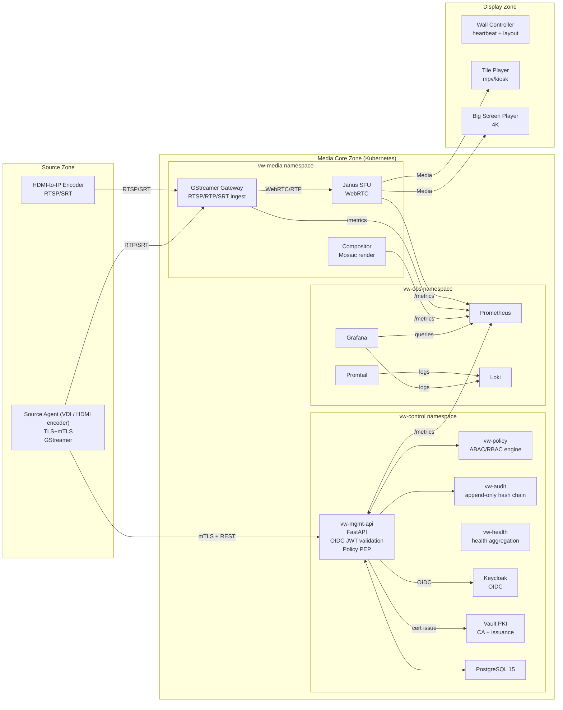
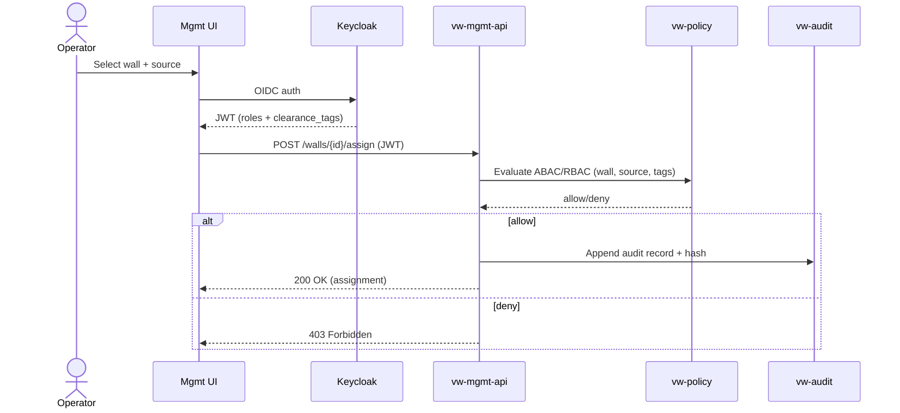
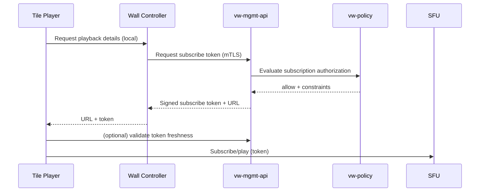
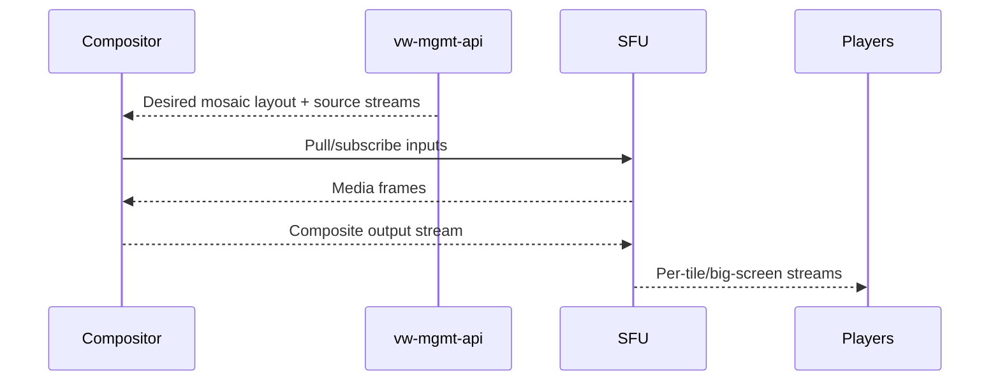

# Architecture

## Component view

## Sequences

### a) Operator assigns source to wall

### b) Tile player subscribes

### c) Compositor renders mosaic

## Data flow notes
- Control plane uses **mTLS** between services and agents.
- Operator plane uses **OIDC** (Keycloak) to obtain JWT; mgmt-api validates and enforces RBAC/ABAC.
- Media plane uses WebRTC/SRTP (interactive) or RTP/SRT (lower complexity) depending on endpoint class.
