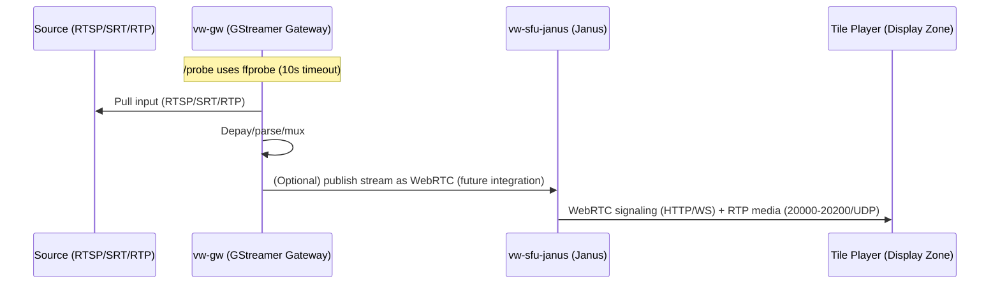
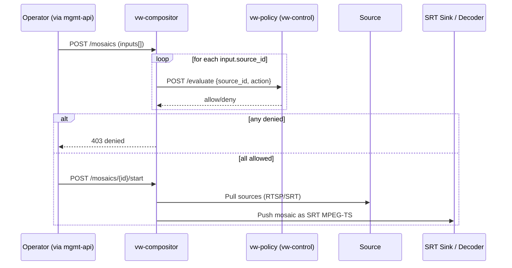

# Module 2 Architecture (Media Plane)

## Sequence: source → gateway → SFU → tile player



## Sequence: compositor policy check → pull sources → SRT output



## Component view (Module 2)

```mermaid
flowchart LR
  subgraph SZ[Source Zone]
    SRC1[RTSP Source]
    SRC2[SRT Encoder]
  end

  subgraph MC[vw-media (Kubernetes)]
    GW[vw-gw :8004]
    COMP[vw-compositor :8005]
    SFU[vw-sfu-janus :8088/:8188\nRTP 20000-20200/UDP]
  end

  subgraph CZ[vw-control]
    POL[vw-policy :8002]
    MGMT[vw-mgmt-api]
  end

  subgraph DZ[vw-display]
    TP[Tile Player / Decoder]
  end

  MGMT -->|HTTP 8004| GW
  MGMT -->|HTTP 8005| COMP
  MGMT -->|HTTP/WS 8088/8188| SFU

  COMP -->|HTTP 8002| POL
  GW -->|RTSP/SRT/RTP| SZ
  COMP -->|RTSP/SRT| SZ
  SFU -->|RTP 20000-20200| TP
  TP -->|HTTP/WS 8088/8188| SFU
```
