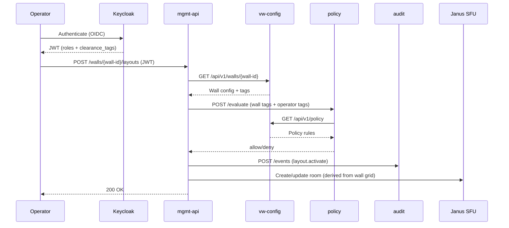

# Architecture Overview

## Dynamic Configuration Model

All wall counts, source definitions, codec policies, and ABAC rules are
**declaratively configured via YAML** and served by the `vw-config` Configuration
Authority. No code changes are needed to add/remove walls or sources.

```
┌──────────────────────────────────────────────────────────────────────┐
│                    platform-config.yaml                              │
│  platform: { max_streams: 64, codec: {tiles: h264, mosaics: hevc}} │
│  walls: [{id: wall-alpha, grid: 6×4}, {id: wall-charlie, screens: 2}]│
│  sources: [{id: vdi-01, type: webrtc}, {id: hdmi-01, type: srt}]   │
│  policy: { rules: [...] }                                           │
└──────────────────────┬───────────────────────────────────────────────┘
                       │ ConfigMap / Signed Bundle
                       ▼
              ┌─────────────────┐
              │   vw-config     │ ← Configuration Authority (SBB-CONFIG-AUTHORITY)
              │  Validate/Watch │ ← JSONSchema + file watcher
              │  Serve/Audit    │ ← REST API + audit chain logging
              └────────┬────────┘
         ┌─────────────┼─────────────┬──────────────┐
         ▼             ▼             ▼              ▼
    ┌─────────┐  ┌──────────┐  ┌──────────┐  ┌──────────────┐
    │mgmt-api │  │ policy   │  │SFU ctrl  │  │ compositor   │
    │walls/src│  │ABAC rules│  │auto-rooms│  │auto-mosaics  │
    └─────────┘  └──────────┘  └──────────┘  └──────────────┘
```

## Zone Architecture

```
┌─────────────────────────────────────────────────────────────────┐
│ Source Zone (VLAN 10)                                           │
│  VDI WebRTC Encoders ─┐    HDMI SRT/RTSP Encoders ─┐         │
│                        │                             │         │
└────────────────────────┼─────────────────────────────┼─────────┘
                         │                             │
┌────────────────────────┼─────────────────────────────┼─────────┐
│ Media Core Zone (K8s)  │                             │         │
│                        ▼                             ▼         │
│  vw-control ns: mgmt-api ↔ policy ↔ audit ↔ vw-config        │
│  vw-media ns:   Gateway → SFU (Janus) → Compositor           │
│  vw-obs ns:     Prometheus / Grafana / Loki                   │
│                        │                             │         │
└────────────────────────┼─────────────────────────────┼─────────┘
                         │                             │
┌────────────────────────┼─────────────────────────────┼─────────┐
│ Display Zone (VLAN 30) │                             │         │
│  Tile Players (Pi) ◄───┘  Big-Screen Players (Pi) ◄─┘         │
│  Wall Controller (per-wall agent, fetches config from vw-config)│
└─────────────────────────────────────────────────────────────────┘
```

## Component Responsibilities

| Component | Role | Config Source |
|-----------|------|--------------|
| **vw-config** | Configuration Authority — loads, validates, watches, serves YAML config | ConfigMap / bundle |
| **mgmt-api** | API gateway — orchestration, token issuance, CRUD. Reads walls/sources from vw-config | vw-config API |
| **policy** | ABAC evaluation — rules + tags from config | vw-config API |
| **audit** | Append-only hash-chained audit log | Direct (logs config changes) |
| **Janus SFU** | WebRTC media forwarding — rooms auto-created per tile-wall | vw-config (via mgmt-api) |
| **Gateway** | Ingest (SRT/RTSP/RTP→WebRTC) — workers per config-defined source | vw-config API |
| **Compositor** | GPU mosaic rendering — pipelines per bigscreen-wall | vw-config API |
| **Wall Controller** | Per-wall endpoint agent (Pi) — fetches tile config, manages player | vw-config API |
| **Tile Player** | mpv kiosk on Pi — decodes single tile stream (DRM/KMS, hw decode) | Wall Controller |

## vw-config API Endpoints

| Method | Path | Description |
|--------|------|-------------|
| `GET` | `/healthz` | Status, `active_hash`, `last_reload_ts`, `last_error` |
| `GET` | `/api/v1/config` | Canonical JSON (sorted keys, stable hash) + `X-Config-Hash` header |
| `GET` | `/api/v1/config/raw` | YAML as stored on disk |
| `GET` | `/api/v1/config/version` | Config version + hash + load metadata |
| `POST` | `/api/v1/config/dry-run` | Validate YAML body → derived metrics + `predicted_hash` (no apply) |
| `POST` | `/api/v1/config/reload` | Force reload from disk |
| `GET` | `/api/v1/derived` | Computed metrics: tiles, SFU rooms, bandwidth, concurrency |
| `GET` | `/api/v1/walls[/{id}]` | Wall definitions from config |
| `GET` | `/api/v1/sources[/{id}]` | Source definitions from config |
| `GET` | `/api/v1/policy` | Policy rules + taxonomy |

### Last-Known-Good State

If the config file becomes invalid (bad YAML, schema failure, concurrency exceeded, duplicate IDs), the service **keeps serving the previous valid config**. The error is:

- Returned in `/healthz` as `last_error`
- Logged to the append-only JSONL event log (`/var/lib/vw-config/events.jsonl`) as `config_rejected`
- Not propagated to consumers — they continue using the last good config

On next successful reload, `last_error` is cleared and `config_applied` is logged.

### Canonical JSON + Config Hash

The config is canonicalized (sorted keys, no whitespace) to produce a deterministic SHA-256 hash. This hash is used for:

- Change detection (file watcher compares hashes)
- Audit trail (config_applied/config_rejected events include old + new hashes)
- API consumers (X-Config-Hash header, /healthz active_hash)

## Hot Reload Strategy

| Component | Reload Method | Restart Required? |
|-----------|--------------|-------------------|
| vw-config | File watcher (5s poll on ConfigMap mount) | No |
| mgmt-api | Polls vw-config API on request | No |
| policy | Polls vw-config API on evaluation | No |
| SFU controller | Reconciliation loop creates/removes rooms | No |
| compositor | Pipeline manager adds/removes mosaics | Graceful restart for GPU pipeline changes |
| gateway | Worker manager spawns/kills per source | No |
| wall controller | Polls vw-config for assignment | No |
| Pi player | Restart by wall controller on reassignment | Service restart (fast) |

## Mermaid: Control Plane Flow



## Configuration Delivery

### Online (K8s cluster)
```
Helm values → ConfigMap → vw-config file watcher → API consumers
```

### Offline (air-gapped bundle)
```
bundlectl export → USB → bundlectl import → ConfigMap update → vw-config → API
```

All config bundles are signed (Ed25519) and checksum-verified before apply.
